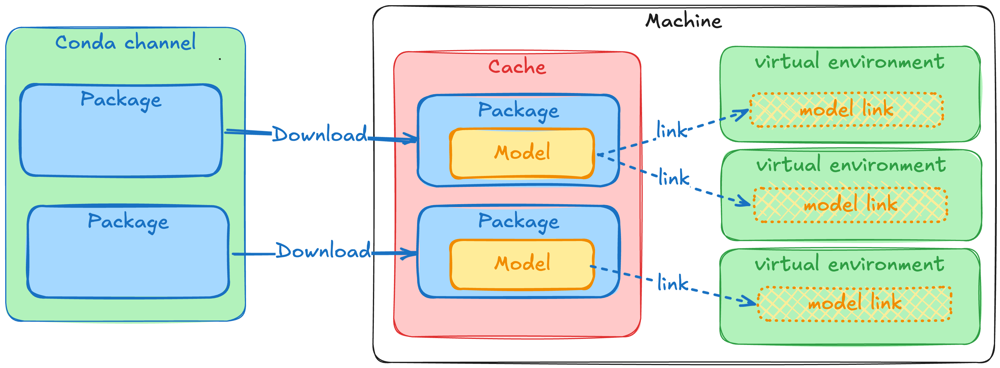

# Packaging an AI/ML model as a conda package

Are you working on LLM distribution, MLOps or just want to have a better way to distribute your models? This blog post is for you.

Anything can be a conda package, including static files like AI/ML models. This blog post will show you a potential way to package and distribute a model. I hope this sparks some ideas from the community on how to properly package these models and what the best practices would be.

I first used this approach of packaging models when I was working on Robotics. We used conda packages to distribute the self trained deep learning models to teams and projects. This approach allowed us to have a single source of everything related to the software running on the machine and it made it easy to track what model was used by the different steps in our development to deployment pipeline.

Conda packages come with a few nice features that help you manage your models:

- Versioning: You can have multiple versions of the same model and easily switch between them.
- Locking: Because the models are now packaged, you can use the lockfiles to lock down the exact model you want to run. Avoiding mistakes like not correctly downloading the model or using an older version by accident.
- Dependencies: Define what your model can be installed with and what it depends on. Through the resolver you can make sure that the right version of model is matched with the right version of the software using it.
- Channels: A conda channel is a really simple place to store data and make it available for download. You can have a private channel for your organization or use a public one like conda-forge.
- Caching/Networking: conda packages are already designed to be downloaded and cached. This all can be reused for the models as well. No need to have extra infrastucture or scripts to download the models and cache them.
- Standardization: Because there are multiple channels that are community managed, there is an opportunity to start one for models, more on that later.
- Traceability: Using the security features of modern packaging ecosystems like signing and attestations you can have a better traceability of the models and their provenance.

## How to package a model

In its simplest form, you just move a file into the prefix and you're done.

So let's see how this looks like in a recipe:

`recipe.yaml`:

```yaml
package:
  name: whisper.cpp-model-ggml-tiny-en-q5_1
  version: 1.0.0

source:
  url: https://huggingface.co/ggerganov/whisper.cpp/resolve/main/ggml-tiny.en-q5_1.bin?download=true

build:
  noarch: generic
  script:
      # make sure that the `$PREFIX/bin` directory exists
      - mkdir -p $PREFIX/share/whisper.cpp/models
      # move or copy the binary to the `$PREFIX/bin` directory
      - mv ggml-tiny.en-q5_1.bin $PREFIX/share/whisper.cpp/models/

tests:
  - package_contents:
      files:
          exists:
          - share/whisper.cpp/models/ggml-tiny.en-q5_1.bin

about:
  homepage: https://huggingface.co/ggerganov/whisper.cpp/
  license: MIT
  summary: A whisper.cpp model in ggml format repackaged as a conda package
  repository: https://huggingface.co/ggerganov/whisper.cpp/
```

You can build this recipe with:

```bash
rattler-build build -r recipe.yaml
```

Now let's look into some ideas to improve the experience.

### Using environment variables

The first thing we can do is to set an environment variable that points to the location of the model. This way the user can easily find the model and use it in their code.

Replace the build section with:

```yaml
build:
  noarch: generic
  script: |
      # make sure that the `$PREFIX/bin` directory exists
      mkdir -p $PREFIX/share/whisper.cpp/models
      # move or copy the binary to the `$PREFIX/bin` directory
      mv ggml-tiny.en-q5_1.bin $PREFIX/share/whisper.cpp/models/

      # Add the WHISPER_MODEL_DIR environment variable to point to the model directory
      mkdir -p "${PREFIX}/etc/conda/env_vars.d"
      # Echo the json content to a file in the env_vars.d directory
      echo "{\"WHISPER_MODEL_DIR\": \"\$CONDA_PREFIX/share/whisper.cpp/models\"}" > "${PREFIX}/etc/conda/env_vars.d/${PKG_NAME}.json"
```

Now the model package will add a file to the `env_vars.d` directory that sets the `WHISPER_MODEL_DIR` environment variable to point to the location of the model.
This way you can easily find the model through the environment variable.

After installing the package, you can run the model with:

```bash
pixi run 'whisper-cli -m $WHISPER_MODEL_DIR/ggml-tiny.en-q5_1.bin'
```

> Note that using `$` in `pixi run` run needs to be escaped with `'`(single quotes) before and after the command to avoid your shell trying to expand the variable before it is passed to the Pixi environment.

### Using build string for variants

The previous example used a single package for a single model, but this would create lots of different packages.
This could become a maintenance issue and it would be hard to keep track of all the different packages and versions.

An alternative approach would be to use the build string to embed the exact model type and then have a single recipe that can build multiple variants of the model.

```yaml
package:
  name: whisper.cpp-model-ggml
  version: 1.0.0

source:
  url: https://huggingface.co/ggerganov/whisper.cpp/resolve/main/ggml-${{ model_type }}.bin?download=true

build:
  noarch: generic
  number: 0
  string: ${{ model_type | replace('.', '_') | replace('-', '_') }}
  script: |
    # make sure that the `$PREFIX/bin` directory exists
    mkdir -p $PREFIX/share/whisper.cpp/models
    # move or copy the binary to the `$PREFIX/bin` directory
    mv ggml-${{ model_type }}.bin $PREFIX/share/whisper.cpp/models/

    # Add the WHISPER_MODEL_DIR environment variable to point to the model directory
    mkdir -p "${PREFIX}/etc/conda/env_vars.d"
    # Echo the json content to a file in the env_vars.d directory
    echo "{\"WHISPER_MODEL_DIR\": \"\$CONDA_PREFIX/share/whisper.cpp/models\"}" > "${PREFIX}/etc/conda/env_vars.d/${PKG_NAME}.json"

tests:
  - package_contents:
      files:
        exists:
          - share/whisper.cpp/models/ggml-${{ model_type }}.bin
  - script: test "$WHISPER_MODEL_DIR" = "$PREFIX/share/whisper.cpp/models"

about:
  homepage: https://huggingface.co/ggerganov/whisper.cpp/
  license: MIT
  summary: A whisper.cpp model in ggml format
  repository: https://huggingface.co/ggerganov/whisper.cpp/
```

Next to this file you can keep a `variants.yaml` file that defines the different model types you want to build:

```yaml
model_type:
  - tiny-q5_1
  - tiny.en
  - tiny.en-q8_0
  - small
  - small.en
  - medium
  - medium-q8_0
  - medium.en
```

Rattler build can pickup this variant file automatically or you can define it with:

```bash
rattler-build build -r recipe.yaml -m variants.yaml
```

## File size, networking and caching

These models can be quite large, into the multiple gigabytes, so you want to make sure they are cached and not redownloaded every time.
Most AI/ML frameworks use the `~/.cache/framework_name` directory to store the models which is easy to understand.
When using conda packages it will use the normal conda package caching mechanics which is a bit more hidden.
That said it's not too complex and a proven caching approach, so it's easy to reuse.
To get the models into the virtual environments the installers will move it in using hardlinks or reflinks, meaning that you don't need to worry about growing disk space.



## Traceability through attestations and trusted publishers

Supply chain security is more important than ever, traceability is the first step in being able to combat these attacks and make sure you know where your software and models are coming from.
When combining the model packaging and distribution through [prefix.dev](https://prefix.dev) with [trusted publishers](https://prefix.dev/docs/prefix/channels#publish-using-trusted-publishers), you can ensure the integrity and origin of your own models.
This will cryptographically sign the package and make sure the contents of the package is exactly what it was when it was built.


When you build your own models, you are able to sign them using the `rattler-build publish --generate-attestation`.
In combination with trusted publishers this allows you to track where the model was built, who(which repository) built it and that the contents of the package is exactly what it was when it was built.

With the current focus on supply chain security and the provenance of software, this is an important aspect to consider when building and distributing models.

It's as simple as running this in your GitHub Actions CI/CD pipeline:

```yaml
permissions:
  contents: read
  id-token: write

jobs:
  build:
    runs-on: ubuntu-latest
    steps:
      - uses: actions/checkout@v4
  
      - name: Set up rattler-build
        uses: prefix-dev/rattler-build-action@v0.2.19

      - name: Upload all packages
        shell: bash
        run: |
          rattler-build publish ./recipes/variant_recipe.yaml --to https://prefix.dev/proto-model-forge --generate-attestation
```

More information can be found in the rattler-build [documentation](https://rattler-build.prefix.dev/latest/authentication_and_upload).

Sigstore also has a blogpost on model transparency and provenance that is worth checking out: [Taming the Wild West of ML: Practical Model Signing with Sigstore](https://blog.sigstore.dev/model-transparency-v1.0/).

## Questions

The setup above works but it raises some questions with regards to standardization.

- What should be the naming scheme of the packages?
- What metadata is important to include for the models?
- What is the best location in the environment to put the models and how to make sure the software can find it?
- What is the best approach to support the workflow where multiple models are used and switched between?
- Does it make sense to do global installations of these models and let tools find those too?

I welcome the community to start a discussion around these questions in the [conda zulip](https://conda.zulipchat.com/) or in the [prefix.dev discord](https://discord.gg/kKV8ZxyzY4) and share your ideas and approaches to packaging models.

## Example repository

To play around with this, you can check out the [example repository](https://github.com/ruben-arts/models-as-packages).

It package's one type of model for the [`whisper.cpp`](https://github.com/ggerganov/whisper.cpp) project, feel free to check it out and play around with it.
You can build the packages with `rattler-build` and install them with `pixi global install --path path_to_package.conda`.
It also contains a publish command to publish the package to the `prefix.dev` channel, but you can also publish it to your own channel or just keep it locally.

For this blogpost I published some of the packages to the `prefix.dev` channel [`proto-model-forge`](https://prefix.dev/channels/proto-model-forge), so you can also just install them from there.

> Note that prefix.dev has a package size limit of 1GB so if you want to publish larger models contact us to get that limit increased.

## Conclusion

The conda packaging format offers an improved experience compared to downloading single files manually or through scripts.
It offers features like versioning, tracebility, reproduciblity, and caching.
There is lots of potential for the community to start standardizing on how to package models.
This way it becomes easier to build, share and distribute models.

If you need help with packaging your models or software in general, feel free to contact us!
